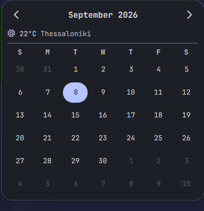
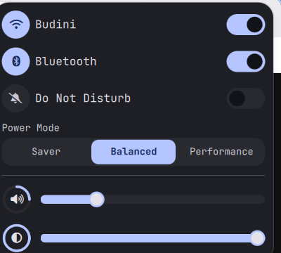

#  Iori's Dotfiles

> Personal Wayland desktop configuration for Arch Linux running **Hyprland**, **Quickshell**, **Rofi**, and **kitty**. One script sets up a fresh machine end to end -- see [Installation](#installation--deployment).
  WORK IN PROGRESS!!
---

##  Screenshots

| Bar | Calendar + weather | Quick Settings |
| :---: | :---: | :---: |
|  |  |  |


---

##  Components

| Component | Tool |
| :--- | :--- |
| **Window Manager** | [Hyprland](https://hyprland.org) |
| **Status Bar** | [Quickshell](https://git.outfoxxed.me/quickshell/quickshell) |
| **Notifications** | [mako](https://mako-project.org) |
| **Application Launcher** | [Rofi](https://davatorium.github.io/rofi) |
| **Terminal** | [kitty](https://github.com/kovidgoyal/kitty) |
| **System Info** | [Fastfetch](https://github.com/fastfetch-cli/fastfetch) |
| **Shell** | [Fish](https://fishshell.com/) |

---

##  Core Keybindings

| Keybinding | Action |
| :--- | :--- |
| `ALT` + `SPACE` | Open the Quickshell launcher |
| `SUPER` + `V` | Open clipboard history |
| `SUPER` + `W` | Open the wallpaper picker |
| `SUPER` + `L` | Lock screen |
| `ALT` + `RETURN` | Open kitty Terminal |
| `ALT` + `Q` | Close Active Window |
| `SUPER` + `R` | Reload Hyprland Config |
| `SUPER` + `SHIFT` + `E` | Quit Hyprland |
| `SUPER` + `1-9` | Switch Workspaces |
| `SUPER` + `SHIFT` + `1-9` | Move Window to Workspace |
| `SUPER` + `h/j/k/l` (or arrows) | Move focus |
| `SUPER` + `SHIFT` + `h/j/k/l` (or arrows) | Swap window |
| `Print` | Screenshot: full screen (saved + copied) |
| `SHIFT` + `Print` | Screenshot: region (copied only) |
| `SUPER` + `SHIFT` + `S` | Screenshot: region (saved only) |

---

##  Installation & Deployment

`install.sh` bootstraps a fresh Arch Linux machine end to end: installs every
package this setup depends on (official repo via `pacman`, plus `mpvpaper`
and `xfce-polkit` from the AUR via `yay`/`paru` if one is installed), enables
`NetworkManager`/`bluetooth`/`power-profiles-daemon`, symlinks every app
config into place, sets up the [qs-wallpaper-picker](https://github.com/magetsu002/qs-wallpaper-picker)
integration (with matugen dynamic theming wired to Quickshell, Hyprland's border
colors, and kitty's 16-color terminal palette -- which fastfetch and any
other TUI program then inherits), and creates the runtime directories the
shell expects.

```bash
git clone https://github.com/iorii1/dotfiless.git ~/dotfiless
cd ~/dotfiless
./install.sh
```

Safe to re-run: package installs are `--needed`, and any real (non-symlink)
file or directory already sitting where a config symlink needs to go gets
backed up to `<name>.bak` instead of overwritten.

After installing, log out and back into Hyprland (or reboot) to pick up
autostart changes. Colors default to a fixed palette until you pick a
wallpaper -- drop images into `~/Pictures/Wallpapers` and press `SUPER + W`.
