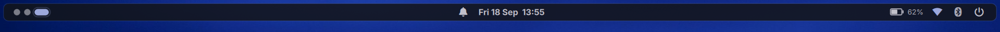
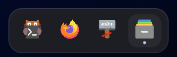
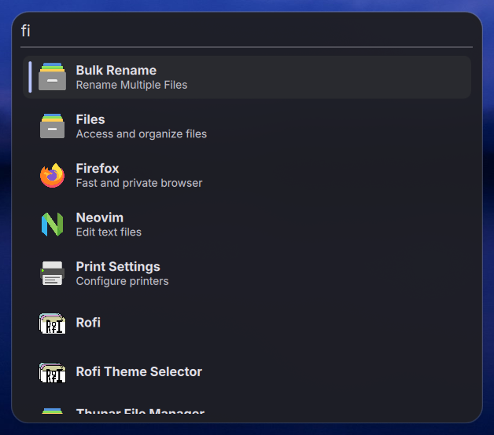
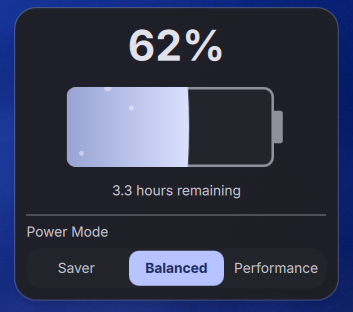

# Iori's Dotfiles

> Personal Wayland desktop for Arch Linux: **Hyprland** + a custom **Quickshell**
> shell, themed end to end from your wallpaper. One script sets up a fresh
> machine -- see [Installation](#installation).

---

## Screenshots



| Dock | Launcher | Battery + power mode |
| :---: | :---: | :---: |
|  |  |  |

---

## What's in the shell

Everything below is QML in `quickshell/`, written for this setup rather than
assembled from widgets:

- **Bar** -- workspaces, cava audio visualiser, MPRIS media widget with cover
  art, clock, notification bell, system tray, battery, Wi-Fi, Bluetooth and a
  power button. Height, margin, corner radius, opacity and per-widget
  visibility are all live-editable (`SUPER + ,`).
- **Dock** -- the window list, kept out of the bar. It stays hidden until the
  pointer reaches the bottom centre of the screen, then slides up; clicking a
  pill focuses that window, and the focused one carries a dot underneath.
  `qs ipc call dock toggle` pins it open without the pointer.
- **Launcher** (`SUPER + SPACE`) -- fuzzy app search.
- **Overview** (`SUPER + TAB`) -- workspace grid with window icons.
- **Clipboard history** (`SUPER + V`) -- cliphist-backed, with real image
  thumbnails.
- **Notification centre** (`SUPER + N`) -- history, do-not-disturb, plus
  toast popups. The shell *is* the notification daemon; there is no mako.
- **Quick settings** -- Wi-Fi, Bluetooth, battery/power-profile, calendar with
  weather, and media, each its own popup from its bar icon.
- **OSD** -- volume and brightness overlays on the media keys.
- **Power menu** -- hold-to-confirm buttons for lock/suspend/logout/reboot/off.
- **Bar settings** (`SUPER + ,`) -- GUI for the bar's layout and widgets,
  persisted to `~/.local/state/quickshell/bar.json`.

## Components

| Component | Tool |
| :--- | :--- |
| **Compositor** | [Hyprland](https://hyprland.org) |
| **Shell** (bar, launcher, notifications, OSD) | [Quickshell](https://quickshell.org) |
| **Theming** | [matugen](https://github.com/InioX/matugen) (Material You from the wallpaper) |
| **Terminal** | [kitty](https://github.com/kovidgoyal/kitty) |
| **Lock / idle** | [hyprlock](https://github.com/hyprwm/hyprlock) + [hypridle](https://github.com/hyprwm/hypridle) |
| **System info** | [Fastfetch](https://github.com/fastfetch-cli/fastfetch) |
| **Shell (CLI)** | [Fish](https://fishshell.com/) + [Starship](https://starship.rs) |

---

## Keybindings

| Keybinding | Action |
| :--- | :--- |
| `SUPER` + `SPACE` | Application launcher |
| `SUPER` + `RETURN` | Terminal |
| `SUPER` + `Q` | Close window |
| `SUPER` + `V` | Clipboard history |
| `SUPER` + `N` | Notification centre |
| `SUPER` + `TAB` | Workspace overview |
| `SUPER` + `,` | Bar settings |
| `SUPER` + `W` | Wallpaper picker |
| `SUPER` + `Escape` | Lock screen |
| `SUPER` + `F` | Fullscreen |
| `SUPER` + `SHIFT` + `SPACE` | Toggle floating |
| `SUPER` + `1-9` | Switch workspace |
| `SUPER` + `SHIFT` + `1-9` | Move window to workspace |
| `SUPER` + `Page_Up/Down` | Previous / next workspace |
| `SUPER` + `SHIFT` + `Page_Up/Down` | Move window to previous / next workspace |
| `SUPER` + `h/j/k/l` (or arrows) | Move focus |
| `SUPER` + `SHIFT` + `h/j/k/l` | Swap window |
| `SUPER` + `CTRL` + `h/j/k/l` | Resize window |
| `SUPER` + `LMB` / `RMB` | Move / resize window (drag) |
| `SUPER` + `R` | Reload Hyprland config |
| `SUPER` + `M` / `SUPER` + `SHIFT` + `E` | Quit Hyprland |
| `Print` | Screenshot: full screen (saved + copied) |
| `SHIFT` + `Print` | Screenshot: region (copied) |
| `SUPER` + `SHIFT` + `S` | Screenshot: region (saved) |

Media, volume and brightness keys are bound to the `XF86*` keys and work while
locked; `SHIFT` + mute toggles the *microphone*, and `SHIFT` + a brightness key
jumps straight to full or minimum. Two- and three-finger touchpad swipes change
focus and workspace.

### Controlling the shell from the CLI

Every panel is reachable over Quickshell's IPC, which is useful if you've
hidden a bar widget in the settings app and still want its popup:

```bash
qs ipc call <target> toggle     # also: open, close
```

Targets: `launcher`, `clipboard`, `notifications`, `overview`, `settings`,
`network`, `bluetooth`, `battery`, `calendar`, `media`, `power`, `dock`.
Plus `qs ipc call osd volume|brightness` and `qs ipc call theme reloadColors`.

`qs-log` (a fish function) tails the shell's log -- start there when something
misbehaves.

---

## Installation

Requires Arch Linux (the installer uses `pacman`).

```bash
git clone https://github.com/iorii1/dotfiles.git ~/dotfiles
cd ~/dotfiles
./install.sh
```

The clone can live anywhere -- `install.sh` bakes its own location into the
matugen config it generates.

`install.sh` installs the packages, enables `NetworkManager`, `bluetooth` and
`power-profiles-daemon`, symlinks the configs into `~/.config`, renders
`~/.config/matugen/config.toml`, and sets up the
[qs-wallpaper-picker](https://github.com/magetsu002/qs-wallpaper-picker)
integration. `mpvpaper` and `xfce-polkit` come from the AUR and are installed
only if `yay` or `paru` is present.

It is safe to re-run: package installs are `--needed`, and any real file
sitting where a symlink belongs is moved to `<name>.bak` rather than clobbered.

Log out and back in afterwards to pick up the autostart entries. Colours stay
on a fallback palette until you pick a wallpaper: drop images into
`~/Pictures/Wallpapers` and press `SUPER + W`.

### Monitors

`hypr/.config/hypr/monitors.lua` has this machine's outputs in it. Replace them
with your own -- `hyprctl monitors` lists the names. A catch-all entry means
unlisted outputs still come up at their preferred mode.

### Fonts

The UI targets Apple's **SF Pro** / **SF Mono**, which can't be packaged. They
are optional: the shell resolves fonts at startup and falls back to **Inter**
(installed by `install.sh`) automatically. To use the real thing, download it
from [Apple](https://developer.apple.com/fonts/), drop the `.otf` files in
`~/.local/share/fonts`, run `fc-cache -f`, and restart the shell.

Nerd Font icons always render from JetBrainsMono regardless of the UI font.

---

## Theming

Picking a wallpaper runs `wallpaper-picker/dotfiless_matugen.sh`, which:

1. normalises the image to a PNG (so AVIF/HEIC work regardless of what
   ImageMagick was built with),
2. detects monochrome wallpapers and switches matugen to a greyscale scheme --
   otherwise Material You falls back to a stock blue that has nothing to do
   with your image,
3. runs matugen over the eight templates in `matugen/templates/`,
4. reloads Quickshell's palette, Hyprland, and signals kitty (`SIGUSR1`) so
   open terminals re-read their colours.

Outputs land in the repo (all gitignored) and feed Quickshell, Hyprland's
border colours, hyprlock, kitty's 16-colour palette (which fastfetch and other
TUIs inherit), cava's gradient, and the GTK3/GTK4 palette that Qt apps pick up
via `QT_QPA_PLATFORMTHEME=gtk3`.

If theming misbehaves, the script logs to `/tmp/dotfiless-matugen.log`.

---

## Known limitations

- **Connecting to a new secured Wi-Fi network from the bar fails.** `nmcli`
  can't prompt for a passphrase from the shell, so connect once with
  `nmcli`/`nmtui` and the bar will handle it from then on. The popup now
  reports the failure instead of doing nothing.
- Hyprland is configured in **Lua** (`hypr/.config/hypr/*.lua`). There is no
  `.conf` fallback.

## Uninstall

`install.sh` only creates symlinks, so removing them is enough:

```bash
rm -f ~/.config/hypr/{hyprland,monitors,keybinds,autostart,colors}.lua \
      ~/.config/hypr/{hyprlock,hypridle,hyprlock-colors}.conf \
      ~/.config/kitty/{kitty,colors}.conf \
      ~/.config/xdg-desktop-portal/hyprland-portals.conf \
      ~/.local/bin/take-screenshot
rm -f ~/.config/{quickshell,fastfetch,fish,cava,gtk-3.0,gtk-4.0}
rm -rf ~/.config/matugen ~/.local/state/quickshell
```

Anything the installer moved aside is still there as `<name>.bak`.

---

## Credits

- [qs-wallpaper-picker](https://github.com/magetsu002/qs-wallpaper-picker) by
  magetsu002 -- the wallpaper picker. `wallpaper-picker/` holds a modified
  `Settings.qml` and the theming hook that `install.sh` copies over the clone.
- The Hyprland animation bezier curves (`mangoOpen` / `mangoClose`) and several
  keybinding choices are adapted from the [mango](https://github.com/DreamMaoMao/mango)
  WM config.
- Design and motion cues from [Caelestia](https://github.com/caelestia-dots/shell)
  and [Noctalia](https://github.com/noctalia-dev/noctalia-shell).

## License

[MIT](LICENSE).
